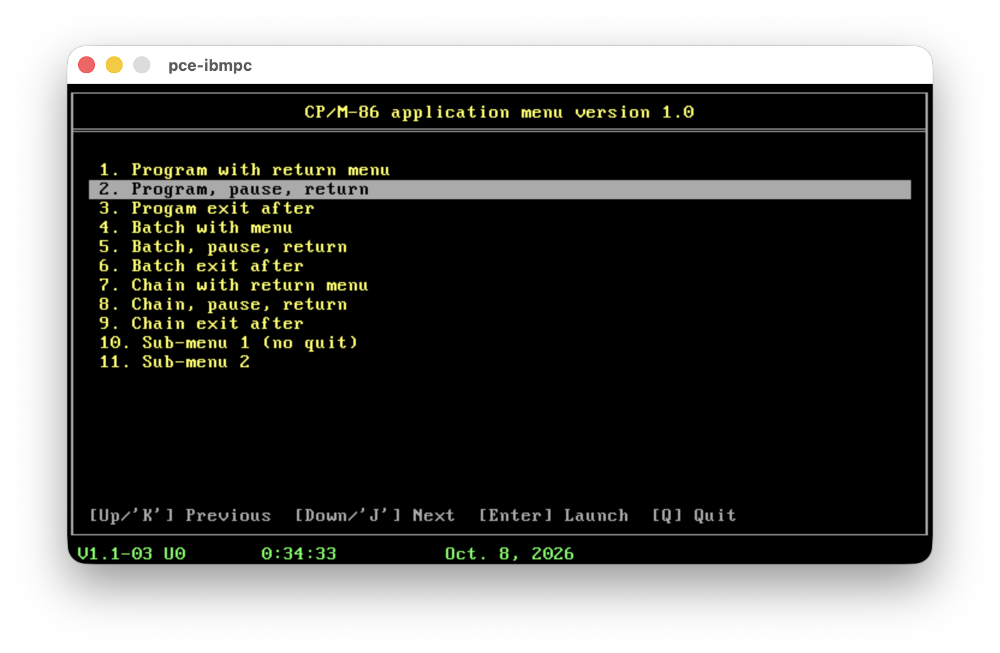

# Menu — CP/M-86 1.1 Application Menu

A lean interactive launch menu for CP/M-86 1.1 (BDOS 2.2; `menu.cmd` refuses
to start on any other version, as the submit management is radically different starting with BDOS 3.0, using real process management). Reads `menu.dat`, displays a navigable list, and launches the chosen program via `$$$.sub` so the CCP picks it up on exit. 
It can be considered as an invented precursor to the concurrent dos batch menu but for BDOS 2.2. The foundation is the submit management by CCP.
It is also an nice way to illustrate a solution/workaround to the lack of process management in BDOS 2.2.


This menu program is accompanied by an msub.cmd command which is a clean room replacement for submit more tolerant to badly shaped content (ignore empty lines, comments starting with ';' space trimming ...)



## Installation

| File | Where |
|------|-------|
| `menu.cmd` | Default drive, any user area |
| `menu.dat` | Same directory as `menu.cmd` |
| `msub.cmd` | Optional: SUBMIT replacement, any drive (see [MSUB](#msub)) |


## Usage

### MENU

```
MENU [file.dat] [/n] [/P]
```

| Argument | Meaning |
|---|---|
| `file.dat` | Menu file to load (default `menu.dat`), drive prefix allowed. |
| `/n` | Start with entry `n` (1-based) selected. Ignored (entry 1 is selected) if `n` is 0 or beyond the number of entries, e.g. after the `.dat` was edited. |
| `/P` | Show "Press any key to return to the menu" and wait before drawing. |

`/n` and `/P` are mostly written by `menu.cmd` itself in the re-launch line,
so the menu comes back on the entry that was run and, for `EP`/`SP`/`CP`
entries, after a key press.

### MSUB

```
MSUB [/N] file[.SUB] [parm1 parm2 ...]
```

| Argument | Meaning |
|---|---|
| `/N` | Check only (see below): expand and validate the file, write nothing. |
| `file` | Job file, drive prefix allowed (`B:BACKUP`). `.SUB` is added when no type is given. |
| `parm1` … `parm9` | Replace `$1` … `$9` in the file. Missing parameters expand to nothing. Each is used up to 32 characters. |

With no argument MSUB prints its banner and usage and does nothing. The
`.sub` file rules (`$$`, `^x`, `;` comments, limits) are in
[S / S! files](#s--s-files). Behaviour inside a running job: see [MSUB](#msub).


## menu.dat Format

Each line is a **directive**. Lines starting with `;` are comments; blank lines
are ignored. Lines may end with CR LF, LF or CR alone (mixed is fine), and
reading stops at `^Z`. A line longer than 255 characters is skipped. Leading and trailing whitespace around labels and commands is trimmed.
Maximum 15 entries per file.

### Directives

| Directive | Syntax | Description |
|-----------|--------|-------------|
| `T` | `T {title}` | Set the title bar text. Optional; default title used if absent. |
| `Q!` | `Q!` | Disable the `Q`/Quit key entirely. |
| `E` | `E {label} \| {command}` | Launch command; re-launch `MENU` afterwards (stays in menu loop). |
| `EP` | `EP {label} \| {command}` | As `E`, then wait for a key before the menu redraws (output stays visible). |
| `E!` | `E! {label} \| {command}` | Launch command; exit cleanly — no `MENU` re-launch. |
| `S` | `S {label} \| {file} [{params}]` | Run a SUBMIT file; re-launch `MENU` afterwards. |
| `SP` | `SP {label} \| {file} [{params}]` | As `S`, then wait for a key once the whole file has run. |
| `S!` | `S! {label} \| {file} [{params}]` | Run a SUBMIT file; exit cleanly — no `MENU` re-launch. |
| `M` | `M {label} \| {menu.dat}` | Selectable entry: load a sub-menu in-process. |
| `M!` | `M! {menu.dat}` | Directive (not an entry): set the `B`/Back destination for this dat file. |
| `C` | `C {label} \| {command}` | Chain directly to command via `P_CHAIN`; `MENU datfile` queued in `$$$.sub` so CCP returns to menu after. |
| `CP` | `CP {label} \| {command}` | As `C`, then wait for a key before the menu redraws. |
| `C!` | `C! {label} \| {command}` | Chain directly to command via `P_CHAIN`; exits cleanly with no re-launch. |

### Field limits

| Field | Max length |
|-------|-----------|
| title (`T`) | 70 chars |
| label | 70 chars |
| command / file+params | 125 chars (longer entries are skipped, never cut) |

### Example

```
; Main menu
T  My CP/M-86 System

E  WordStar 4        | WS
E  SuperCalc 3       | SC
EP Directory         | DIR
SP Run backup        | BACKUP DRIVE A
M  Utilities         | utils.dat
E! Exit to CP/M      | EXIT
```

### Notes

- If an `M`/`M!` target file is missing or empty, the switch is silently ignored
  and the current menu stays active.
- A sub-menu file — a `.dat` with an `M!` directive — that contains no `S!`
  entries is treated as exit-only: `E`, `S` and `C` entries in it behave like
  `E!`, `S!` and `C!` (no `MENU` re-launch). The main `menu.dat` (no `M!`) is
  never exit-only.
- If an `S` file is missing, empty or invalid, or `$$$.sub` cannot be written,
  the error is shown on the footer line and the menu stays active.

### Nesting (menu inside a SUBMIT job)

`$$$.sub` is used as a stack. When `MENU` is itself a line of a running
SUBMIT job (or of another menu's `S` file), what is left of that job stays in
`$$$.sub` and every launch is pushed **on top** of it:

- `E` / `S` / `C` run the entry, then `MENU` again, as usual.
- `E!` / `S!` / `C!` run the entry, then the rest of the outer job.
- `Q` leaves the menu and the outer job carries on.

`MENU` started from the keyboard starts a fresh `$$$.sub` (any stale one is
removed). Running DR `SUBMIT.CMD` as an entry still replaces the whole file
(that is how `SUBMIT` works); use an `S` entry instead to keep the stack.
`$$$.sub` holds at most 128 commands in total.

### S / S! files

Expanded by `menu.cmd` itself with the DR `SUBMIT` rules, then pushed on the
`$$$.sub` stack:

- `{file}` gets `.SUB` when it has no type; a drive prefix is allowed
  (`B:BACKUP` → `B:BACKUP.SUB`).
- `$1`..`$9` are replaced by the parameters (missing ones expand to nothing;
  each parameter is used up to 32 chars), `$$` gives `$`, `^A`..`^Z` give the
  control character.
- Leading and trailing blanks are removed and blank lines are skipped.
- A line whose first non-blank character is `;` is a comment and is skipped.
  A `;` anywhere else is ordinary text passed to the command:

  ```
      ;    this whole line is ignored
  command ; this is kept, the command gets "; this is kept…"
  ```
- Limits: 125 chars per expanded line, 64 lines per file. Exceeding either is
  reported as an error rather than truncated.
- Lines may end with CR LF, LF or CR alone. Reading stops at the first `^Z`
  (CP/M end of text). `.sub` files made on a
  host and copied with `cpmcp` should end with `^Z` if DR `SUBMIT.CMD` will
  also read them: `SUBMIT` reads the whole last record, including any junk
  after the text. `menu.cmd` does not need the `^Z` itself.

### Drives and user areas

- The re-launch line written to `$$$.sub` is drive-qualified:
  `[D:]MENU D:file.dat /n [/P]`. The `MENU` prefix is the drive `menu.cmd` was started
  from (e.g. `B:MENU` typed at `A>`), read from the CCP command buffer; the
  `.dat` file gets the current drive when it has none.
- Programs that change drive or user themselves (BDOS 14/32) are fine: the CCP
  restores its own drive and user on warm boot before reading `$$$.sub`.
- `$$$.sub` is created on the current drive and user, and the CCP reads it from
  the drive and user it is on at that moment. An entry or `.sub` line that is
  a bare drive change (`B:`) or `USER n` therefore ends the `$$$.sub` chain:
  the remaining lines and the `MENU` re-launch are not run. Use a
  drive-prefixed command instead (`E Prog | B:PROG`), which loads from `B:`
  without changing the CCP's current drive. A possible way to support real
  drive/user switching is described in [drive-user.md](drive-user.md).


## Keys

| Key | Action | Notes |
|-----|--------|-------|
| `↑` / `K` | Move selection up | |
| `↓` / `J` | Move selection down | |
| `Enter` | Launch selected entry | |
| `Q` | Quit to CP/M prompt, or back to the SUBMIT job that started `MENU` | Disabled if `Q!` present in `.dat` |
| `B` | Back to parent menu | Only shown after navigating into an `M!` sub-menu |


## MSUB

`msub.cmd` is a drop-in SUBMIT built on the same library as the menu
(`sub_load`), so `.sub` files behave exactly as in `S` entries.

```
B>MSUB

MSUB SUB ORCHESTRATOR VER 1.0

USAGE: MSUB [/N] file[.SUB] [parm1 parm2 ...]
  /N  check only: expand and validate the file, write nothing
```

| | DR `SUBMIT` | `MSUB` |
|---|---|---|
| Expansion | `$1`..`$9`, `$$`, `^A`..`^Z` | same, plus blank lines and `;` comment lines (`;` first non-blank) skipped, blanks trimmed |
| Run from inside a running job | replaces `$$$.sub` (rest of the outer job is lost) | pushes on top: the outer job continues afterwards |
| Errors | `Error On Line n` | `ERROR: <reason> FILE.SUB, line n`. Nothing is written. |
| Limits | 125 chars per line | 125 chars per line, 64 lines, 128 records in `$$$.sub` |

### MSUB /N (check only)

`MSUB /N job p1 p2` runs the same load as a real run and reports, without
writing `$$$.sub` or starting the CCP:

```
B>MSUB /N JOB A B

MSUB SUB ORCHESTRATOR VER 1.0

Checking JOB.SUB

  line 2: DIR A
  line 3: B:
  line 5: TYPE B ^C

WARNING: line 3: drive/user change ends the $$$.SUB chain,
         the commands after it will not run. Use B:PROG instead.
OK: 3 commands = 3 of 128 records. Nothing written.
```

| Check | Result |
|---|---|
| file missing / empty | `ERROR`, nothing listed |
| line over 125 chars, more than 64 lines, bad `^x` | `ERROR` with the source line number |
| expanded lines | listed with their source line (`^C` shown as `^C`), so `$n` substitution can be verified |
| a line that is only `X:` or `USER n` | `WARNING`: it ends the `$$$.sub` chain (see *Drives and user areas*) |
| records: existing `$$$.sub` + new commands | `ERROR` above 128 (the CCP reads one extent). The existing count only applies when MSUB runs inside a job. |
| CCP not recognised | `WARNING`: a real run would write `$$$.sub` but not start it |

`MSUB` can be used inside `.sub` files, in `E` entries and in other `MSUB`
jobs to build nested jobs.


## Limitations

- **CP/M-86 1.1 only.** `menu.cmd` checks for BDOS 2.2 at start. The hand-over
  to the CCP also requires the known CCP layout (signature check, see
  [submit-flow.md](submit-flow.md)). On an unrecognised CCP the commands are
  written to `$$$.sub` but the CCP is not told to run them.
- **No bare drive or user change in a chain.** `B:` or `USER n` as an entry or
  `.sub` line ends the `$$$.sub` chain (see *Drives and user areas*).
- **DR `SUBMIT.CMD` as an entry** replaces the whole `$$$.sub` stack, including
  the `MENU` re-launch and any outer job. Use `S` entries instead.
- **Stack size:** `$$$.sub` holds at most 128 commands in total (the CCP only
  reads the first 16K extent). An `S` file is limited to 64 lines of up to 125
  characters.
- **Menu size:** 15 entries per `.dat`, labels up to 70 characters, commands
  up to 125.
- **No cancel key for a running chain.** This CCP is patched not to stop a
  `$$$.sub` run on a key press. `^C` inside a program does not end submit mode
  either: the BDOS abort path (`CONSTA`) keeps `MDSUBE` or sets it again when
  it finds `$$$.sub` while resetting the disks. A menu with `Q!` therefore has
  no exit by design.
- **emu2:** good for testing the UI and the `$$$.sub` contents. It cannot run
  the CCP loop: BDOS fn 0 ends the emulator instead of returning to a CCP.


## Design documents

| Document | Contents |
|---|---|
| [implementation.md](implementation.md) | Modules, startup, key loop, launch path, CCP access, data formats, limits — mostly diagrams. |
| [submit-flow.md](submit-flow.md) | How `$$$.sub` hands commands to the CCP and loops back to `MENU`, including `MENU` inside a SUBMIT job (section 7). |
| [drive-user.md](drive-user.md) | Proposal (not implemented) for running entries in another drive / user area. |


## Build

Requires the `cpm86-crossdev` toolchain (`aztec42_cc`, `aztec42_link`, etc.).

```
make          # builds menu.cmd, msub.cmd and hello.cmd
make dist     # msub.zip: menu.cmd, msub.cmd, hello.cmd, sample .dat/.sub,
              # soak test files (they expect to run from B: with STAT on A:)
make sub.lib  # builds the $$$.sub library independently
make clean    # removes all generated files
```


## sub.lib API

Reusable CP/M-86 library for writing `$$$.sub` submit files.

| Function | Signature | Description |
|----------|-----------|-------------|
| `sub_open` | `int sub_open(int flags)` | `SUB_CREATE`: delete any `$$$.sub` and create it. `SUB_APPEND`: open it and push on top of the records already there (creates it if absent). Returns 0 / -1. |
| `sub_append` | `int sub_append(char *cmd)` | Push one 128-byte record (command uppercased, max 125 chars). Fails once the file holds 128 records. Returns 0 / -1. |
| `sub_close` | `int sub_close(void)` | Close. Returns 0 / -1. |
| `sub_records` | `int sub_records(void)` | Records in the existing `$$$.sub` (0 if none). Opens it read-only, writes nothing. |
| `sub_abort` | `int sub_abort(void)` | Undo everything since `sub_open`: delete the file if it was created, else restore its record count. Returns 0 / -1. |
| `sub_delete` | `int sub_delete(void)` | Delete `$$$.sub` if present. |
| `sub_exit` | `void sub_exit(void)` | Set the CCP submit flag and warm boot (BDOS 0): the CCP runs the top record. Does not return. |
| `p_chain` | `void p_chain(char *cmd, int submode)` | Chain to `cmd` (BDOS 47). `submode` non-zero also sets the CCP submit flag so `$$$.sub` runs afterwards. |
| `sub_active` | `int sub_active(void)` | 1 if the CCP is in submit mode (program started from `$$$.sub`), 0 if not, -1 if the CCP is not recognised. |
| `sub_cmddrv` | `int sub_cmddrv(void)` | Drive prefix of the command the CCP is running (1 = A … 16 = P), 0 if none or unknown. |
| `sub_load` | `int sub_load(char *cmd)` | Read and expand `"[d:]file[.typ] [p1 …]"` (`subfile.c`). Returns the line count (> 0) or a `SUBERR_*` code (≤ 0). |
| `sub_line` | `char *sub_line(int i)` | Expanded line `i` (0 = first line of the file). |
| `sub_pushall` | `int sub_pushall(void)` | Push all loaded lines on the open `$$$.sub`, last first. Returns 0 / -1. |
| `sub_name` | `char *sub_name(void)` | File actually opened, e.g. `B:BACKUP.SUB`. |
| `sub_errmsg` | `char *sub_errmsg(int err)` | Message for a `SUBERR_*` code; the file name follows it. |
| `sub_errline` | `int sub_errline(void)` | Source line of the last error, 0 if none. |
| `sub_lineno` | `int sub_lineno(int i)` | Source line number of loaded line `i`. |
| `sub_readln` | `int sub_readln(FILE *fp, char *buf, int size)` | Read one text line (CR LF, LF or CR end, stops at `^Z`). Returns its length, `SUB_RD_EOF`, or `SUB_RD_LONG` if it did not fit. Also used for `.dat` files. |

Typical use (this is all of `MSUB`):

```c
n = sub_load("JOB P1 P2");                  /* read + expand, nothing written */
if (n <= 0) { /* sub_errmsg(n), sub_name(), sub_errline() */ }
sub_open(sub_active() == 1 ? SUB_APPEND : SUB_CREATE);
sub_pushall();
sub_close();                                /* on failure: sub_abort()       */
sub_exit();                                 /* CCP runs it, no return        */
```

`sub_exit`, `p_chain`, `sub_active` and `sub_cmddrv` live in `os.asm` and only
touch the CCP after recognising the CP/M-86 1.1 CCP (version 22h and the
`MENUSIG`/`SUBNAM` signature).

Records are written last-command-first (stack order) so the CCP executes them top-down.
See [submit-flow.md](submit-flow.md) for the full hand-over between `menu.cmd`,
the BDOS and the CCP.

## Companion projects

| Project | Description |
|---------|-------------|
| [cpm86-kernel](https://github.com/tsupplis/cpm86-kernel)     | CP/M-86 1.1 distribution rebuilt from patched and reconstituted sources |
| [ccpm86-y2k](https://github.com/tsupplis/ccpm86-y2k)         | CCP/M-86 3.1 distribution rebuilt from patched and reconstituted sources |
| [cpm86-crossdev](https://github.com/tsupplis/cpm86-crossdev) | Unix CP/M-86 cross development project (compilers, emulation and tools) |
| [cpm86-hacking](https://github.com/tsupplis/cpm86-hacking)   | CP/M-86 miscellaneous tools and PCE emulator helpers |
| [cpm86-cmdtools](https://github.com/tsupplis/cpm86-cmdtools) | CP/M-86 `.cmd` file manipulation tools |
| [cpm86-ports](https://github.com/tsupplis/cpm86-ports)       | CP/M-86 application ports in C and assembler |
| [cpm86-vi](https://github.com/tsupplis/cpm86-vi)             | STevie vi port for CP/M-86 and PC-DOS 1.1 |
| [cpm86-msbasic](https://github.com/tsupplis/cpm86-msbasic)   | A recreaction of msbasic-86 for CP/M-86 and PC-DOS 1.1 from gwbasic sources |
| [cpm86-menu](https://github.com/tsupplis/cpm86-menu)   | A submit replacement and a menu system for submit orchestration |
| [pcdos11-hacking](https://github.com/tsupplis/pcdos11-hacking) | PC-DOS 1.1 distribution, tools and notes |

## License

MIT — see [LICENSE](LICENSE).
