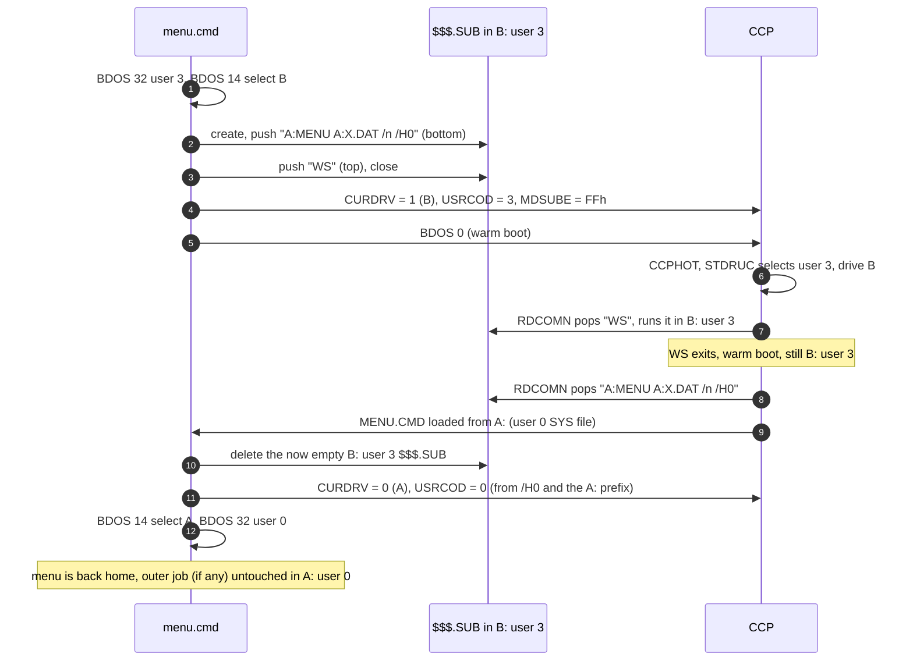

# Drive and user switching — design notes (not implemented)

Status: proposal. Today a menu entry cannot run in another drive or user area
and still come back to the menu. This document explains why and how it could
be done on the CP/M-86 1.1 CCP (`ccp.a86`, `ccpexp.a86`, `ccpnew.a86`). It
builds on [submit-flow.md](submit-flow.md).

---

## 1. The problem

The CCP looks for `$$$.SUB` on **its own current drive and user** (`CURDRV`,
`USRCOD`) every time it is about to read a command (`RDCOMN`).

| What changes drive/user | Effect on the chain |
|---|---|
| A program calling BDOS 14 / 32 | None. Every warm boot enters `CCPHOT` → `STDRUC`, which re-selects the CCP's own `USRCOD` and `CURDRV`. |
| A command line `B:PROG` | None. The CCP loads from B: and switches back to `CURDRV` before running the program. |
| A command line `B:` or `USER 3` | **Breaks the chain.** The CCP updates its own `CURDRV` / `USRCOD`. The next `RDCOMN` looks for `$$$.SUB` there, does not find it, and drops to the keyboard. The rest of the stack, including the `MENU` re-launch, is left behind. |

So the obvious approach, pushing `B:` / `USER 3` lines into `$$$.SUB`, cannot
work: the line that switches is the line that loses the file.

---

## 2. Idea: switch the CCP directly and move the stack with it

`menu.cmd` already writes one CCP variable (`MDSUBE`) after checking the CCP
signature. It can write two more:

| Variable | CCP offset | Same in ccp / ccpexp / ccpnew |
|---|---|---|
| `USRCOD` | `08CEh` | yes |
| `CURDRV` | `0939h` | yes |

Instead of asking the CCP to switch, `menu.cmd`:
1. creates `$$$.SUB` **in the target drive/user**,
2. writes the CCP's `CURDRV` / `USRCOD` to that target,
3. sets `MDSUBE` and warm boots.

`CCPHOT` → `STDRUC` then selects the target user and drive itself, and
`RDCOMN` finds the stack there. The last record re-launches `MENU`, which moves
the CCP back home.

### Proposed `.dat` syntax

An optional suffix on `E`, `EP`, `E!`, `S`, `SP`,
`S!`:

```
E  WordStar        | WS @B:3      ; drive B, user 3
EP Directory of C  | DIR @C       ; drive C, same user
S  Build           | MAKE @:5     ; same drive, user 5
```

### Flow for `E WordStar | WS @B:3` (menu at home A:, user 0)



`/Hu` is a new option carrying the home user. The home drive is already in the
`A:MENU` prefix.

### Nesting

An outer SUBMIT job stays in the home `$$$.SUB` (A: user 0). The switched entry
uses its own short stack in B: user 3. When menu comes back and restores home,
`MDSUBE` is still `FFh` and the outer job carries on as today. The two stacks
never mix.

---

## 3. Requirements and risks

| Item | Notes |
|---|---|
| `MENU.CMD` visible from user 3 | Must be a user-0 file with the SYS attribute. This BDOS's open (`MOPEN`) falls back to user-0 SYS files when the current user is not 0. The `.dat` does not need it, because menu restores home before loading it (step 4 below). |
| Invalid target drive | Selecting a drive that does not exist gives a BDOS error and a warm boot, with the CCP already moved to that drive. Menu must check the drive first, e.g. with a direct BIOS SELDSK (BDOS 50, function 9), as the CCP itself does for `B:`. It should refuse to switch if the drive is invalid. |
| Two more CCP offsets | `CURDRV` (`0939h`) and `USRCOD` (`08CEh`) become part of menu's contract with the CCP, like `MDSUBE`. They should get the same kind of marker comment as `MENUSIG`/`SUBNAM`, and `ccpseg` stays the gate. |
| `C` entries (chain) | Fn 47 runs the command after `STDRUC`, so writing `CURDRV`/`USRCOD` before chaining runs it in the target too. The `MENU` record must then be in the target's `$$$.SUB`, as for `E`. |
| Lines inside `S` files | A `B:` / `USER n` *inside* a `.sub` file still breaks the chain. Supporting that would mean splitting the file into one stack per drive/user, which is out of scope. The `@` suffix applies to the whole entry. |
| Abort paths | `^C` inside the program goes through the BDOS abort. The CCP keeps the target drive/user and `MDSUBE`, so `MENU` is still popped from the target stack and restores home. A cold boot resets the CCP to the boot drive and user 0, leaving a stale `$$$.SUB` in B: user 3. Menu deletes it the next time it creates a stack there. |
| emu2 | Cannot test the loop (no CCP). Test on pce / real hardware. |

---

## 4. Implementation outline

1. `menudat.c`: parse an optional `@[d][:u]` suffix off the command into
   `MenuItem.drive` (0 = unchanged, 1–16) and `MenuItem.user` (-1 = unchanged,
   0–15).
2. `os.asm`: `ccp_setdu(drive, user)` writes `CURDRV`/`USRCOD` through
   `ccpseg`. `ccp_getdu()` reads them (home values).
3. `menu.c` launch: when an entry has `@`, validate the drive, select the target
   (BDOS 14/32), `sub_open(SUB_CREATE)` there, and push
   `[home:]MENU home:dat /n [/P] /Hu` plus the entry. Then call `ccp_setdu`,
   `setsub`, and warm boot or chain.
4. `menu.c` start: on `/Hu`, delete the (empty) `$$$.SUB` in the current
   drive/user, then `ccp_setdu(home)` and BDOS 14/32 back home before loading
   the `.dat`.
5. Docs: README syntax, plus a new section in `submit-flow.md`.
