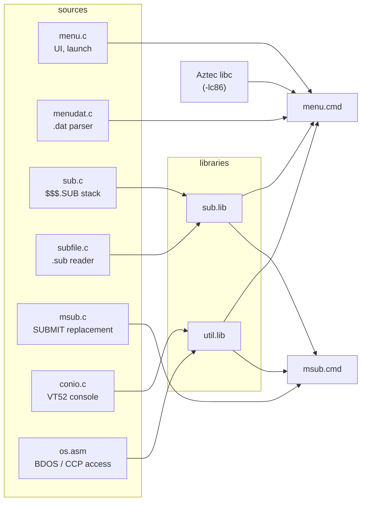
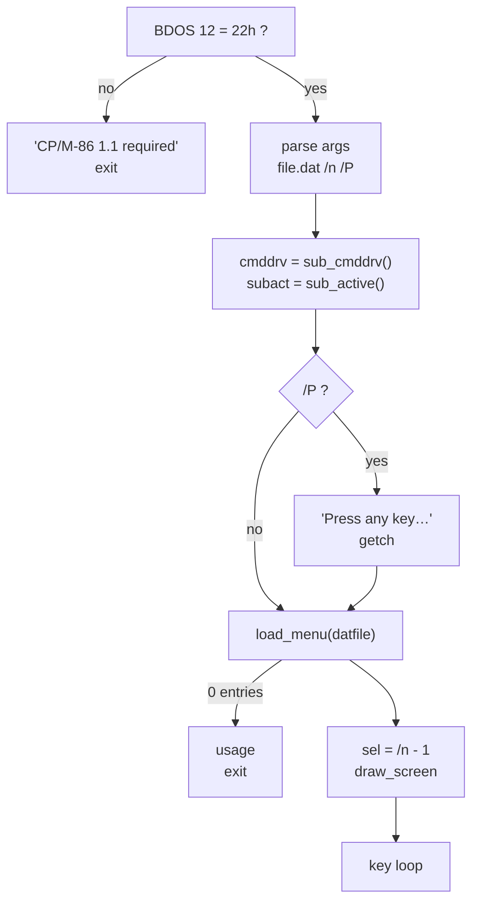
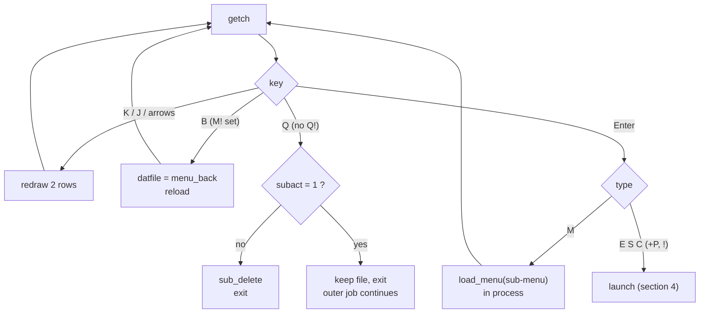
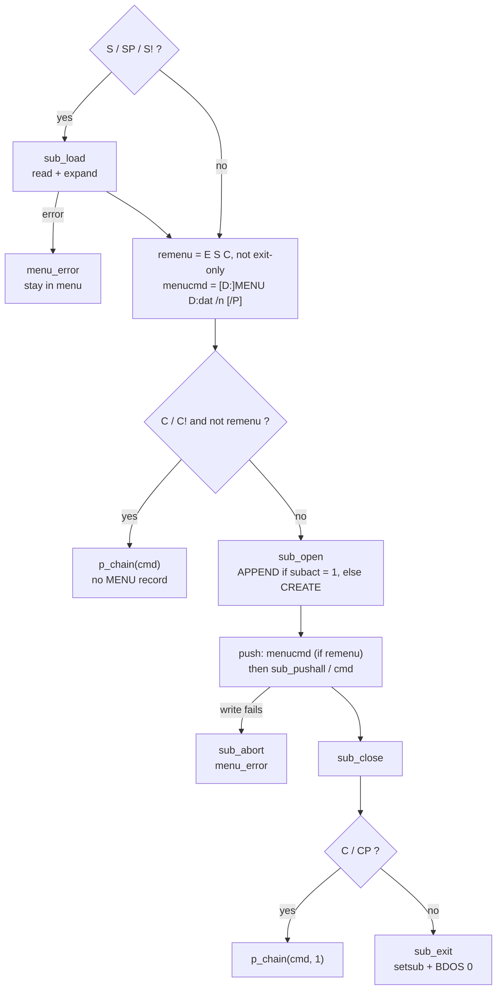
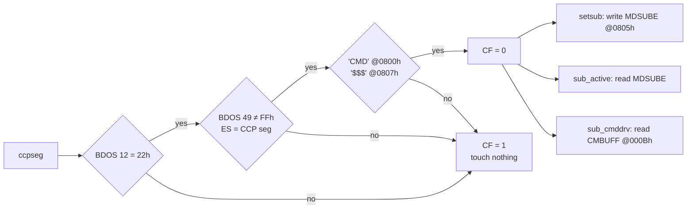

# Implementation overview

How `menu.cmd` is built and how its parts fit. For the CCP hand-over, see
[submit-flow.md](submit-flow.md).

## 1. Modules



| File | Key functions |
|---|---|
| `menu.c` | `main`, `draw_screen`, `draw_entry`, `build_menucmd`, `menu_error` |
| `msub.c` | `main`: banner, usage, `/N` check, `sub_load` → push → `sub_exit` |
| `subfile.c` | `sub_load`, `sub_line`, `sub_pushall`, `sub_name`, `sub_errmsg`, `sub_errline` |
| `menudat.c` | `load_menu` → `items[]`, `menu_title`, `menu_back`, `menu_quit_disabled`, `menu_has_snr` |
| `sub.c` | `sub_open` (CREATE / APPEND), `sub_append`, `sub_close`, `sub_abort`, `sub_delete` |
| `os.asm` | `ccpseg` (gate), `setsub`, `sub_exit`, `p_chain`, `sub_active`, `sub_cmddrv` |
| `conio.c` | `cputs` (BDOS 9 runs), `cputc`, `getch`, `gotoxy`, `clrscr`, `cursor` |

## 2. Startup



## 3. Key loop



## 4. Launch



Exit-only rule: a `.dat` with `M!` and no `S!` entry → `remenu = 0`.

## 5. CCP access (os.asm)



## 6. Data formats

**`$$$.SUB` record** (128 bytes, one per command, last record = top of stack)

| byte 0 | 1 … n | n+1 | n+2 | rest |
|---|---|---|---|---|
| length n (≤ 125) | command, upper case | `00h` | `'$'` | `00h` |

**Re-launch record**

```text
[D:]MENU  D:file.dat  /n  [/P]
 │         │           │    └ EP/SP/CP only: wait for a key first
 │         │           └ entry to select on return
 │         └ current drive added when missing (BDOS 25)
 └ drive MENU was started from (CCP CMBUFF)
```

**`MenuItem`** (`menudat.h`)

| field | size | meaning |
|---|---|---|
| `label` | 71 | shown text |
| `cmd` | 126 | command, `.sub` + params, or `.dat` |
| `type` | int | `MTYPE_E` `ENR` `S` `SNR` `M` `C` `CNR` |
| `pause` | int | 1 for `EP` / `SP` / `CP` |

## 7. Limits

| Item | Limit | On overflow |
|---|---|---|
| entries per `.dat` | 15 | ignored |
| label / title | 70 | cut |
| command | 125 | entry skipped |
| `S` file | 64 lines × 125 chars | error, stay in menu |
| `$$$.SUB` | 128 records | write fails → `sub_abort` |
