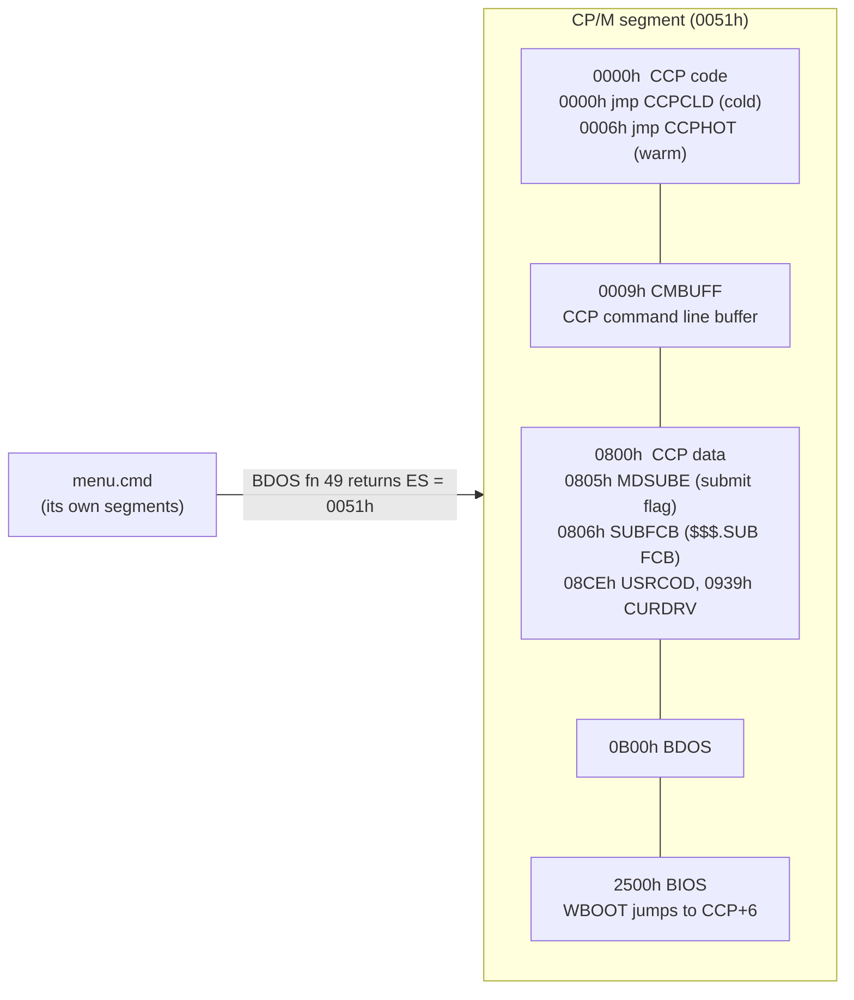
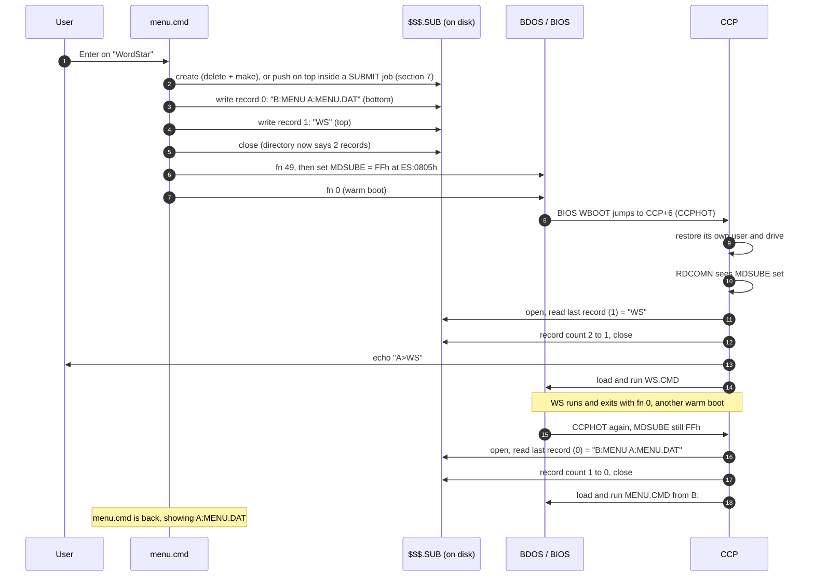
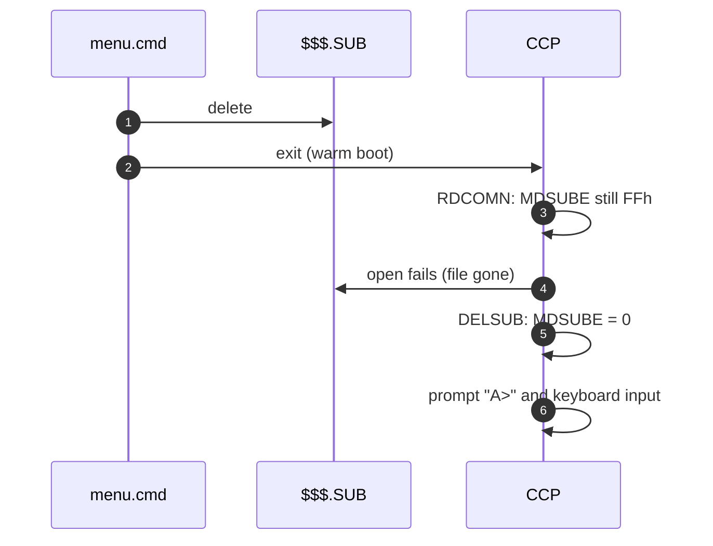
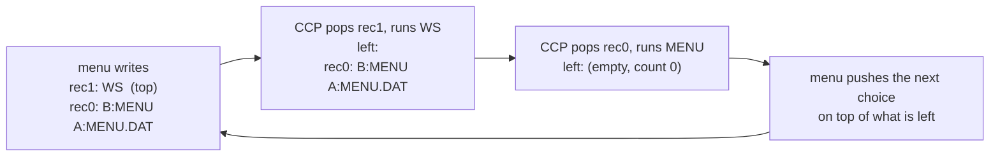
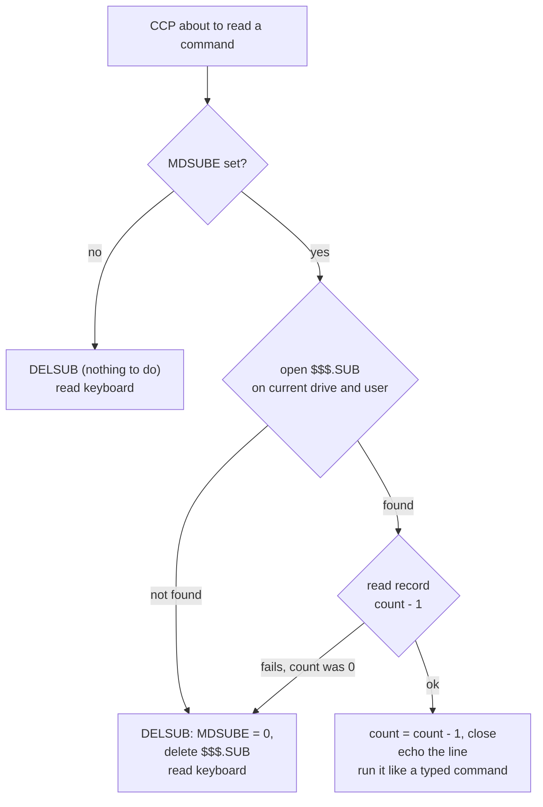
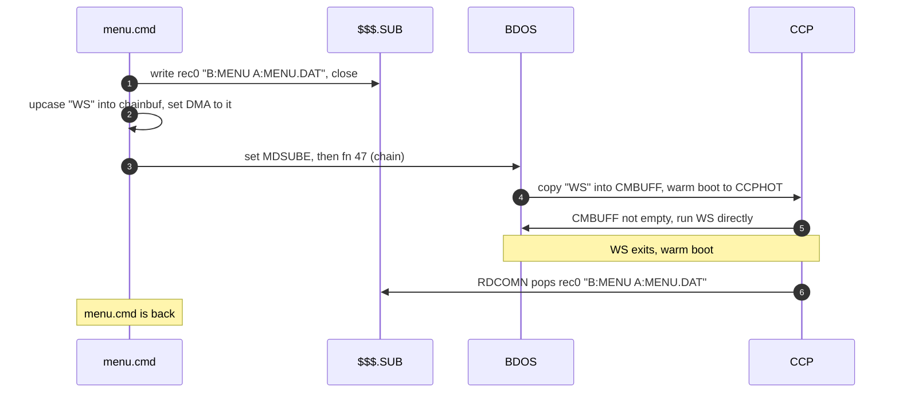
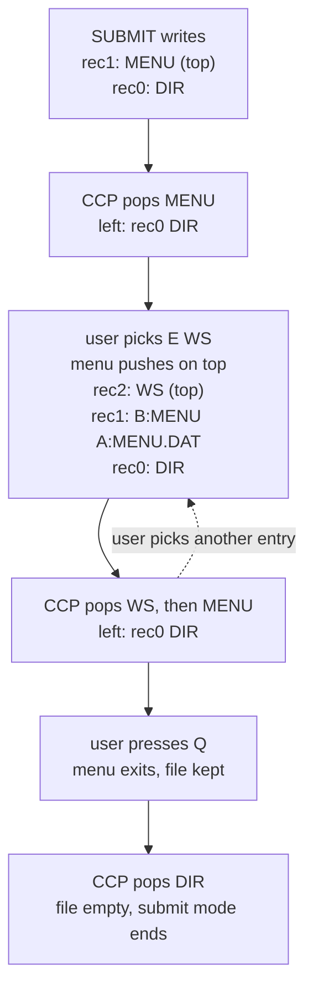

# How `menu.cmd` hands work to the CCP through `$$$.SUB`

CP/M-86 1.1 (BDOS 2.2) runs one program at a time and has no way for a program
to say "run this, then come back to me". `menu.cmd` gets that behaviour by
reusing the mechanism `SUBMIT` uses: it leaves a list of commands in a file
for the CCP and makes the CCP read it.

This document describes the CP/M-86 1.1 CCP/BDOS in `../cpm86-kernel`
(`ccp.a86`, `bdos.a86`, `pcbios.a86`).

---

## 1. The three ingredients

| Ingredient | What it is | Who sets it | Who reads it |
|---|---|---|---|
| `$$$.SUB` | A file of 128-byte records, one command per record. **The last record is the top of a stack**: it runs first. | `menu.cmd` (`sub.c`) | CCP (`RDCOMN`) |
| `MDSUBE` | One byte in the CCP's data area. Non-zero = "read the next command from `$$$.SUB`". | `menu.cmd` (`setsub` in `os.asm`) | CCP (`RDCOMN`, `DELSUB`) |
| Warm boot | BDOS fn 0 (or fn 47, chain). Ends the program and restarts the CCP. | `menu.cmd` (`sub_exit` / `p_chain`) | BDOS → BIOS → CCP |

All three are needed:
- **Without `MDSUBE`**, the CCP does not look at the file. A warm boot enters
  the CCP at its hot-start entry (`CCPHOT`), which never re-checks the disk for
  `$$$.SUB`. Only a cold start (`CCPCLD`) does that.
- **Without the file**, the CCP finds nothing to read, clears `MDSUBE` and
  goes back to the keyboard.

Each record is `[length] [command text] 00h '$' 00h…`, upper case, at most 125
characters. This is the same layout DR `SUBMIT` writes.

---

## 2. Where things live in memory

CCP, BDOS and BIOS are loaded as **one** segment (`0051h` on this system, the
A-base of `CPM.SYS`). Offsets below are inside that segment.



`menu.cmd` cannot hard-code `0051h` because it changes with memory size and
build. It calls BDOS fn 49 ("get system data address"), which returns with
`ES` = this segment, then writes `ES:[0805h]`.

> The original bug wrote to `0000:0805h`, which is physical address `805h`.
> That is `0051:02F5h`, a `ret` inside the CCP's command-name lookup.
> The flag was never set and the CCP code was damaged.

---

## 3. The full loop for an `E` entry (run a command, come back)

The menu item is `E WordStar | WS`, and the menu was started as `B:MENU`.



When the user presses `Q` and `MENU` was started from the keyboard (no outer
job, see section 7):



The loop above started with `MENU` popped from the bottom of the file: `MDSUBE`
is still `FFh` and the file is empty (record count 0). Pressing `Q` then
deletes nothing that matters, and the CCP ends submit mode.

---

## 4. The stack, step by step

The file is a stack. The CCP always takes the **last** record and then lowers
the record count, so the file shrinks from the end.



For an `S` entry, every expanded line of the `.sub` file is pushed in reverse
order on top of the `MENU` line, so they run top-down and `MENU` runs last:

```text
top    rec3  DIR P1          runs 1st
       rec2  TYPE X.TXT      runs 2nd
       rec1  COPY A B        runs 3rd
bottom rec0  B:MENU A:X.DAT  runs last -> back in the menu
```

`E!`, `S!` and `C!`, and every entry in an exit-only sub-menu, leave out the
bottom `MENU` record, so nothing brings the menu back.

---

## 5. How the CCP picks its next command (`RDCOMN`)

This runs every time the CCP is about to show a prompt.



Two consequences:
- **The file is looked up on the CCP's current drive and user.** A program
  that changes drive or user itself (BDOS 14/32) is harmless, because the CCP
  restores its own drive and user at every warm boot. A **command line** `B:`
  or `USER 3` changes the CCP's own drive or user. The next lookup then misses
  the file and the rest of the stack, including `MENU`, is lost.
- **The CCP stops reading the file only when it is empty or gone.** That is
  why `Q` deletes it and why `menu.cmd` recreates it on each launch.

---

## 6. The `C` path (chain): same stack, different start

`C` entries use BDOS fn 47 (chain) instead of fn 0. Chain puts the command
straight into the CCP's command buffer, so the program starts **without** a
`$$$.SUB` read. The file is used only for the way back.



`C!` chains without a `MENU` record. Started from the keyboard, it deletes any stale `$$$.SUB` and does not set `MDSUBE`. Inside a SUBMIT job it keeps the file and sets `MDSUBE`, so the rest of the job runs after the program.

---

## 7. Nesting: `MENU` inside a SUBMIT job

`menu.cmd` never assumes it owns `$$$.SUB`. At start it reads `MDSUBE`
(`sub_active`):

| `MDSUBE` at start | Meaning | Launch | `Q` |
|---|---|---|---|
| `0` | Started from the keyboard. The CCP has already run `DELSUB`, so any `$$$.SUB` left is stale. | `SUB_CREATE`: delete, then write a fresh stack | delete `$$$.SUB`, exit |
| `FFh` | Started from a `$$$.SUB` line. The records still in the file are the rest of an outer job. | `SUB_APPEND`: push on top of them | leave the file, exit: the CCP continues the outer job |
| unknown | CCP not recognised (emu2, other build) | as `0` | as `0` |

Example: the user runs `SUBMIT JOB` with `JOB.SUB` = `MENU`, `DIR`.



To push, `sub_open(SUB_APPEND)` opens the file and sets the current record to
its record count (BDOS open returns the record count of extent 0 in FCB byte
15). Sequential writes then go on top. If a write fails, `sub_abort` puts the
old record count back and closes, the same operation the CCP uses to pop. The
outer job is left as it was. The CCP only reads extent 0, so the stack is
limited to 128 records. `sub_append` refuses to write past that.

---

## 8. Where `menu.cmd` gets the drive letters

The `MENU` line has to work from wherever the CCP is when it pops it.

| Part | Source |
|---|---|
| `B:` before `MENU` | The drive `menu.cmd` was started from. Read from the CCP's command buffer (`CMBUFF+2`, offset `000Bh`), which still holds `B:MENU …` while menu runs (`sub_cmddrv` in `os.asm`). |
| `A:` before the `.dat` | The current drive (BDOS fn 25) when the `.dat` name has none. |

---

## 9. Safety guards

- `menu.cmd` refuses to start unless BDOS fn 12 returns `22h` (CP/M-86 1.1),
  because the offsets above belong to that CCP.
- Before writing `MDSUBE` or reading `CMBUFF`, `ccpseg` (`os.asm`) makes three
  checks: fn 12 = `22h`, fn 49 does not return `0FFh` (not implemented, for
  example under emu2), and the CCP **signature** matches: `'CMD'` at `0800h`
  and `'$$$'` at `0807h` (bit 7 masked). These are the labels `MENUSIG` and
  `SUBNAM` in `ccp.a86`, `ccpexp.a86` and `ccpnew.a86`, which all share this
  layout. On any other CCP build the signature does not match. `menu.cmd`
  then writes nothing into the CCP: the commands are still in `$$$.SUB`, but
  nothing triggers the CCP to run them.
- An `S` file is fully read and checked **before** `$$$.SUB` is created. Any
  error leaves the menu running and no partial `$$$.SUB` behind.
